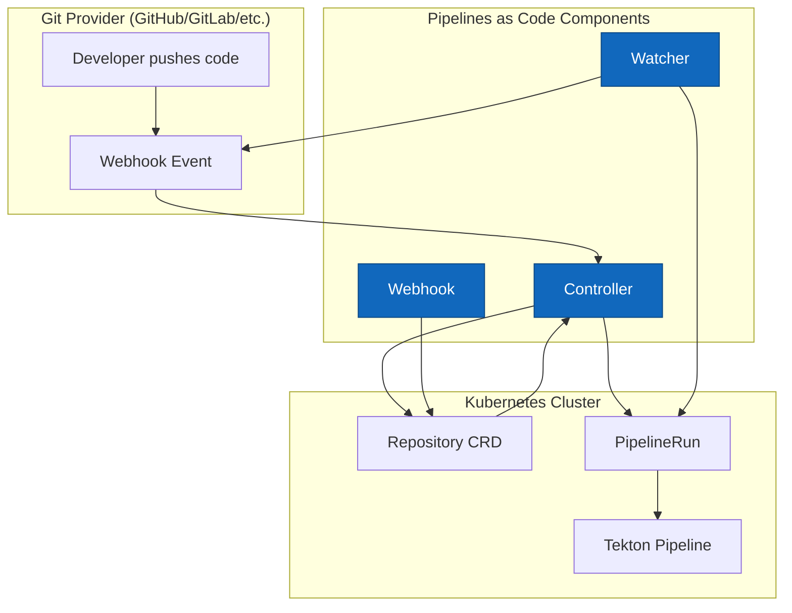

# Core concepts

This guide explains the architecture, components, and key concepts of Pipelines as Code to help you understand how it works and how to use it effectively.

## Architecture overview

Pipelines as Code consists of three main components that work together to provide a complete CI/CD solution for Tekton:

<CardGroup cols={3}>
  <Card title="Controller" icon="server">
    Receives webhook events from Git providers and orchestrates pipeline execution
  </Card>
  <Card title="Watcher" icon="eye">
    Monitors PipelineRun execution and reports status back to Git providers
  </Card>
  <Card title="Webhook" icon="shield-check">
    Validates Repository CRDs and enforces security policies via admission webhook
  </Card>
</CardGroup>

### Component diagram



## Key components

### Controller

The **controller** (`pipelines-as-code-controller`) is the main component that:

- Receives webhook events from Git providers (push, pull request, etc.)
- Matches events to Repository CRDs in the cluster
- Fetches pipeline definitions from the `.tekton/` directory in your repository
- Resolves remote tasks from Tekton Hub or Artifact Hub
- Validates pipeline YAML before submission
- Creates PipelineRuns in the appropriate namespace
- Injects authentication tokens and secrets
- Handles authorization checks (OWNERS files, permissions)

**Location**: `/home/daytona/workspace/source/cmd/pipelines-as-code-controller/main.go:1`

<Info>
The controller uses the Knative eventing adapter pattern to handle events efficiently and scale based on load.
</Info>

### Watcher

The **watcher** (`pipelines-as-code-watcher`) monitors PipelineRun execution and:

- Watches for PipelineRun status changes in real-time
- Collects task logs and error information
- Posts status updates to Git providers (GitHub Checks, GitLab pipelines, etc.)
- Creates comments on pull requests with execution details
- Extracts error snippets and matches them to source code lines
- Updates Repository CR status with recent PipelineRun history

**Location**: `/home/daytona/workspace/source/cmd/pipelines-as-code-watcher/main.go:1`

<Info>
The watcher runs as a separate process with multiple reconcilers for efficient status reporting across many repositories.
</Info>

### Webhook

The **webhook** (`pipelines-as-code-webhook`) is a Kubernetes admission webhook that:

- Validates Repository CRDs before they're created or updated
- Enforces that each repository URL is unique across the cluster
- Validates that repository URLs are well-formed and non-empty
- Prevents security issues from duplicate or invalid repositories

**Location**: `/home/daytona/workspace/source/cmd/pipelines-as-code-webhook/main.go:1`

<Warning>
Disabling this webhook is not supported and may pose a security risk in clusters with untrusted users, as it could allow one user to hijack another's repository.
</Warning>

## Repository Custom Resource Definition (CRD)

The **Repository CRD** is the core configuration object in Pipelines as Code. It serves several purposes:

### Purpose

- Informs Pipelines as Code that events from a specific URL should be handled
- Specifies the namespace where PipelineRuns will be executed
- References API secrets, usernames, or API URLs for Git provider authentication
- Stores the last PipelineRun statuses (5 by default)
- Allows declaring custom parameters that can be expanded in PipelineRuns

### Example

```yaml
apiVersion: "pipelinesascode.tekton.dev/v1alpha1"
kind: Repository
metadata:
  name: my-project
  namespace: my-project-ci
spec:
  url: "https://github.com/myorg/my-project"
  settings:
    pipelinerun_provenance: "source"
    policy:
      ok_to_test:
        - "maintainer1"
        - "maintainer2"
  concurrency_limit: 2
```

**Location**: `/home/daytona/workspace/source/pkg/apis/pipelinesascode/v1alpha1/types.go:11`

### Key fields

<Tabs>
  <Tab title="spec.url">
    The Git repository URL that this CR manages. Must be a valid HTTP/HTTPS URL.
    
    ```yaml
    spec:
      url: "https://github.com/myorg/my-project"
    ```
  </Tab>
  <Tab title="spec.concurrency_limit">
    Maximum number of concurrent PipelineRuns for this repository. Helps prevent resource exhaustion.
    
    ```yaml
    spec:
      concurrency_limit: 3
    ```
  </Tab>
  <Tab title="spec.settings">
    Configuration settings including authorization policies, provider-specific options, and provenance.
    
    ```yaml
    spec:
      settings:
        pipelinerun_provenance: "default_branch"
        policy:
          ok_to_test:
            - "trusted-user"
    ```
  </Tab>
  <Tab title="spec.git_provider">
    Git provider authentication details (for webhook-based integrations).
    
    ```yaml
    spec:
      git_provider:
        type: "gitlab"
        url: "https://gitlab.example.com"
        secret:
          name: "gitlab-token"
          key: "token"
    ```
  </Tab>
</Tabs>

<Note>
You cannot create a Repository CR in the same namespace where Pipelines as Code is deployed (e.g., `pipelines-as-code` namespace).
</Note>

## Event flow

Understanding how events flow through Pipelines as Code helps you troubleshoot issues and optimize your pipelines.

<Steps>
  <Step title="Git event occurs">
    A developer performs an action like:
    - Pushing code to a branch
    - Opening a pull request
    - Commenting on a pull request
    - Creating a tag
    - Merging a pull request
  </Step>
  <Step title="Webhook sent to controller">
    The Git provider sends a webhook payload to the Pipelines as Code controller endpoint. Authentication is verified using:
    - GitHub App JWT signature (for GitHub Apps)
    - Webhook secret (for webhook-based integrations)
  </Step>
  <Step title="Repository lookup">
    The controller:
    - Extracts the repository URL from the webhook payload
    - Searches for a matching Repository CRD across all namespaces
    - If `target-namespace` annotation exists in the pipeline, only searches that namespace
    - Validates that exactly one Repository CR matches
  </Step>
  <Step title="Authorization check">
    The controller verifies the user has permission to trigger pipelines by checking:
    - Repository ownership
    - Collaborator status
    - Organization membership
    - OWNERS file in the repository
    - Policy configuration in the Repository CR
  </Step>
  <Step title="Fetch pipeline definitions">
    The controller:
    - Clones the repository (or fetches from the default branch based on provenance settings)
    - Looks for `.tekton/*.yaml` files in the repository
    - Parses and validates the YAML syntax
  </Step>
  <Step title="Match pipelines to event">
    For each pipeline definition, the controller checks if:
    - The `pipelinesascode.tekton.dev/on-event` annotation matches the event type
    - The `pipelinesascode.tekton.dev/on-target-branch` annotation matches the branch
    - Any CEL expressions in `pipelinesascode.tekton.dev/on-cel-expression` evaluate to true
    - Path filters match the changed files
  </Step>
  <Step title="Resolve remote tasks">
    The controller:
    - Identifies tasks referenced via `resolver: hub` or `resolver: bundles`
    - Fetches task definitions from Tekton Hub, Artifact Hub, or OCI bundles
    - Inlines remote tasks into the pipeline definition
    - Validates the complete pipeline
  </Step>
  <Step title="Variable substitution">
    The controller replaces template variables like:
    - `{{ repo_url }}` - Full repository URL
    - `{{ revision }}` - Git commit SHA
    - `{{ target_branch }}` - Target branch name
    - `{{ source_branch }}` - Source branch name
    - Custom parameters from the Repository CR
  </Step>
  <Step title="Create PipelineRuns">
    The controller:
    - Creates PipelineRun resources in the namespace where the Repository CR exists
    - Injects Git provider tokens as secrets
    - Applies concurrency limits if configured
    - Queues PipelineRuns if needed
  </Step>
  <Step title="Monitor execution">
    The watcher:
    - Watches the created PipelineRuns for status changes
    - Collects logs from each task as they execute
    - Detects task failures and extracts error messages
  </Step>
  <Step title="Report status">
    The watcher:
    - Posts status checks to the Git provider (GitHub Checks, GitLab pipeline status)
    - Creates or updates comments on pull requests
    - Links to dashboard or logs for detailed information
    - Annotates source code lines with error messages (GitHub only)
  </Step>
  <Step title="Update Repository CR">
    The watcher:
    - Updates the Repository CR status with PipelineRun completion information
    - Stores the last 5 PipelineRun statuses by default
    - Includes commit SHA, title, status, and log URL
  </Step>
</Steps>

## Pipeline definitions

Pipeline definitions in Pipelines as Code are standard Tekton PipelineRuns with special annotations.

### Annotations

Annotations control when and how pipelines are executed:

<Tabs>
  <Tab title="on-event">
    Specifies which Git events trigger this pipeline.
    
    ```yaml
    annotations:
      pipelinesascode.tekton.dev/on-event: "[pull_request, push]"
    ```
    
    Supported events:
    - `pull_request` - PR opened, synchronized, or reopened
    - `push` - Code pushed to a branch
    - `incoming` - Manual trigger via incoming webhook
  </Tab>
  <Tab title="on-target-branch">
    Specifies which branches this pipeline applies to.
    
    ```yaml
    annotations:
      pipelinesascode.tekton.dev/on-target-branch: "[main, develop, release/*]"
    ```
    
    Supports glob patterns and regular expressions.
  </Tab>
  <Tab title="on-cel-expression">
    Advanced event matching using CEL (Common Expression Language).
    
    ```yaml
    annotations:
      pipelinesascode.tekton.dev/on-cel-expression: |
        event == "pull_request" && !body.pull_request.draft
    ```
    
    Access to full webhook payload via `body` variable.
  </Tab>
  <Tab title="on-path-change">
    Only trigger if specific files or paths changed.
    
    ```yaml
    annotations:
      pipelinesascode.tekton.dev/on-path-change: "[src/**, tests/**]"
    ```
    
    Useful for monorepos and selective testing.
  </Tab>
</Tabs>

### Template variables

Pipelines as Code provides template variables that are substituted at runtime:

| Variable | Description | Example |
|----------|-------------|----------|
| `{{ repo_url }}` | Full repository URL | `https://github.com/myorg/myrepo` |
| `{{ revision }}` | Git commit SHA | `a1b2c3d4e5f6...` |
| `{{ target_branch }}` | Target branch (for PRs) | `main` |
| `{{ source_branch }}` | Source branch (for PRs) | `feature-123` |
| `{{ sender }}` | User who triggered the event | `developer123` |
| `{{ event_type }}` | Type of event | `pull_request` |

### Example pipeline

```yaml .tekton/pr-build.yaml
apiVersion: tekton.dev/v1beta1
kind: PipelineRun
metadata:
  name: pr-build
  annotations:
    pipelinesascode.tekton.dev/on-event: "[pull_request]"
    pipelinesascode.tekton.dev/on-target-branch: "[main]"
    pipelinesascode.tekton.dev/on-path-change: "[src/**, tests/**]"
spec:
  pipelineSpec:
    tasks:
    - name: fetch-repository
      taskRef:
        name: git-clone
        resolver: hub
      workspaces:
      - name: output
        workspace: source
      params:
      - name: url
        value: "{{ repo_url }}"
      - name: revision
        value: "{{ revision }}"
    - name: run-tests
      runAfter: [fetch-repository]
      taskRef:
        name: golang-test
        resolver: hub
      workspaces:
      - name: source
        workspace: source
  workspaces:
  - name: source
    volumeClaimTemplate:
      spec:
        accessModes:
        - ReadWriteOnce
        resources:
          requests:
            storage: 1Gi
```

## Authentication and authorization

### GitHub App authentication

When using GitHub Apps, Pipelines as Code:

- Authenticates as a GitHub App installation
- Generates short-lived tokens for each repository
- Scopes tokens to specific repositories (configurable)
- Injects tokens into PipelineRuns as secrets
- Automatically refreshes expired tokens

### Webhook authentication

For webhook-based integrations (GitLab, Bitbucket, etc.), you configure:

- A personal access token or API token
- A webhook secret for validating incoming requests
- Stored in Kubernetes secrets referenced by the Repository CR

### Authorization policies

Pipelines as Code enforces authorization to prevent untrusted users from running pipelines:

<CodeGroup>
```yaml OWNERS file
approvers:
  - maintainer1
  - maintainer2
reviewers:
  - developer1
  - developer2
```

```yaml Repository CR policy
apiVersion: pipelinesascode.tekton.dev/v1alpha1
kind: Repository
metadata:
  name: my-project
spec:
  url: "https://github.com/myorg/my-project"
  settings:
    policy:
      ok_to_test:
        - "trusted-contributor"
      pull_request:
        - "external-contributor"
```
</CodeGroup>

## Advanced features

### Provenance control

Control where pipeline definitions are fetched from:

- **`source`** (default): Fetch from the event source (the branch/SHA that triggered the event)
- **`default_branch`**: Always fetch from the repository's default branch (e.g., `main`)

```yaml
spec:
  settings:
    pipelinerun_provenance: "default_branch"
```

<Info>
Using `default_branch` provenance ensures only users who can merge to the default branch can modify pipelines, adding an extra security layer.
</Info>

### Concurrency control

Limit how many PipelineRuns can execute simultaneously:

```yaml
spec:
  concurrency_limit: 2
```

When the limit is reached, additional PipelineRuns are queued and executed in alphabetical order by name.

### Automatic cleanup

Configure automatic cleanup of completed PipelineRuns:

```yaml
metadata:
  annotations:
    pipelinesascode.tekton.dev/max-keep-runs: "5"
```

Older PipelineRuns are automatically deleted, keeping your namespace clean.

### Auto-cancellation

When a new commit is pushed to a PR, Pipelines as Code can automatically cancel in-progress PipelineRuns for the same PR and event type, saving compute resources.

## What's next?

<CardGroup cols={2}>
  <Card title="Quickstart" icon="rocket" href="/quickstart">
    Get your first pipeline running in 5 minutes
  </Card>
  <Card title="Repository CRD" icon="git-alt" href="/guides/repository-crd">
    Configure repositories using the Repository custom resource
  </Card>
  <Card title="Writing pipelines" icon="code" href="/guides/creating-pipelines">
    Create PipelineRun definitions with annotations and template variables
  </Card>
  <Card title="GitOps commands" icon="terminal" href="/guides/gitops-commands">
    Control pipeline execution with ChatOps-style comments
  </Card>
  <Card title="Writing pipelines" icon="code" href="/essentials/authoring-pipelines">
    Deep dive into writing effective pipeline definitions
  </Card>
  <Card title="GitOps commands" icon="terminal" href="/essentials/gitops-commands">
    Control pipelines with /test, /retest, and /cancel
  </Card>
</CardGroup>
