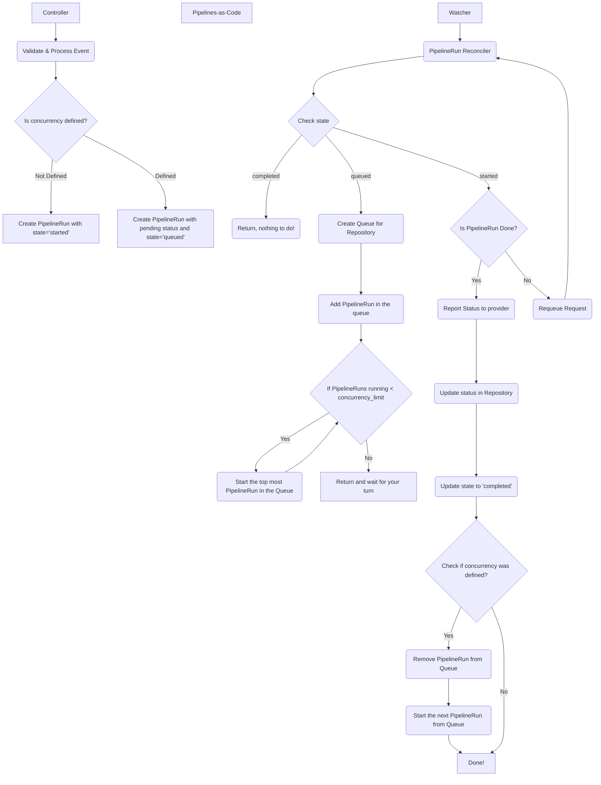
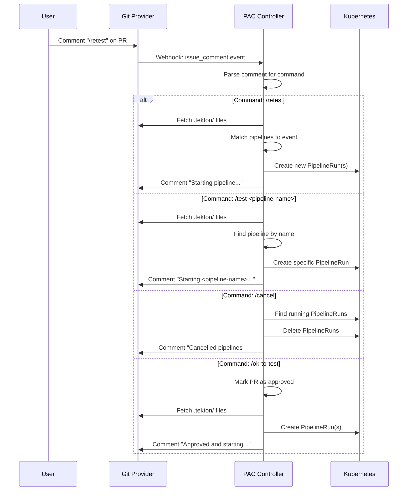
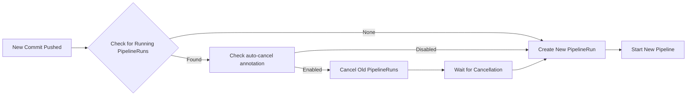
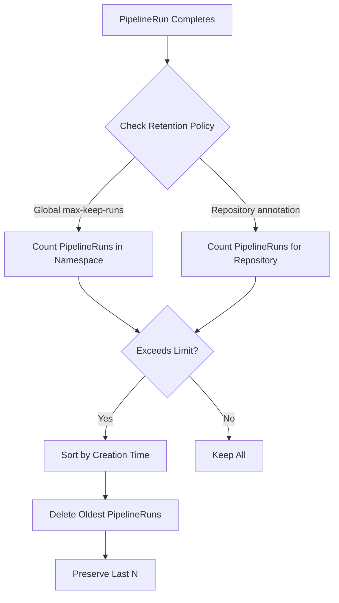
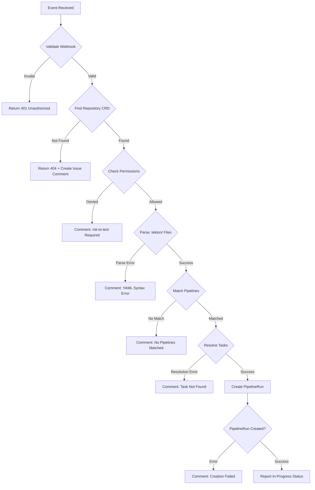

This page provides detailed flow diagrams to help you understand how events are processed through Pipelines as Code.

## Pull/Merge Request Flow

This diagram shows the complete flow when a pull request or merge request is opened:

[](/svg/diagram.svg)

### Flow Steps

<Steps>

<Step title="User Action">
A developer opens a pull request, pushes a commit, or creates a tag in their Git repository.
</Step>

<Step title="Webhook Event">
The Git provider (GitHub, GitLab, Bitbucket, or Forgejo) sends a webhook HTTP POST request to the PAC webhook endpoint.
</Step>

<Step title="Event Reception">
The webhook handler receives the event and validates:
- Webhook signature authentication
- Event payload format
- Skip CI markers (`[skip ci]`, `[ci skip]`)
</Step>

<Step title="Repository Lookup">
The controller:
- Finds the matching Repository CRD in Kubernetes
- Retrieves authentication credentials from secrets
- Validates repository configuration
</Step>

<Step title="Permission Validation">
The ACL system checks:
- User is authorized (org member, collaborator, in OWNERS file)
- Event doesn't require `/ok-to-test` approval
- Repository policy allows execution
</Step>

<Step title="Pipeline Discovery">
The resolver:
- Fetches the `.tekton/` directory from the repository
- Parses all YAML files for PipelineRun definitions
- Filters pipelines based on event type and annotations
</Step>

<Step title="Pipeline Matching">
For each pipeline, check:
- `on-event` annotation matches event type
- `on-target-branch` matches target branch
- `on-cel-expression` evaluates to true (if present)
- `on-path-change` matches changed files (if present)
</Step>

<Step title="Task Resolution">
Resolve remote tasks from:
- Tekton Hub (`resolver: hub`)
- Artifact Hub
- OCI bundles (`resolver: bundles`)
- Git repositories (`resolver: git`)
</Step>

<Step title="Variable Substitution">
Substitute template variables:
- `{{repo_url}}` → Git repository clone URL
- `{{revision}}` → Git commit SHA
- `{{target_branch}}` → Pull request target branch
- `{{source_branch}}` → Pull request source branch
- Custom variables from ConfigMap
</Step>

<Step title="PipelineRun Creation">
Create PipelineRun on Kubernetes with:
- Resolved pipeline specification
- Workspaces and volume claims
- Secrets and service accounts
- Labels and annotations for tracking
</Step>

<Step title="Execution Monitoring">
The watcher monitors the PipelineRun:
- Watches for status changes
- Reports progress to Git provider
- Creates GitHub Checks, GitLab notes, etc.
</Step>

<Step title="Status Reporting">
As the pipeline executes, report:
- In-progress status with task details
- Task completion and timing
- Log snippets for failures
- Error annotations (GitHub only)
</Step>

<Step title="Completion">
When the pipeline completes:
- Report final status (success/failure)
- Post summary comment with logs
- Update Repository CRD status
- Schedule cleanup if retention policy configured
</Step>

</Steps>

## Concurrency Flow

This diagram shows how PAC manages concurrent pipeline executions:



### Concurrency States

<Tabs>
  <Tab title="queued">
  **When**: Concurrency limit reached
  
  **Behavior**:
  - PipelineRun created with `.status.conditions[].reason=Pending`
  - Added to FIFO queue for the repository
  - State annotation: `pipelinesascode.tekton.dev/state=queued`
  
  **Duration**: Until a running PipelineRun completes
  </Tab>
  
  <Tab title="started">
  **When**: PipelineRun begins execution
  
  **Behavior**:
  - PipelineRun scheduled on Kubernetes
  - Tasks begin executing
  - State annotation: `pipelinesascode.tekton.dev/state=started`
  - Status reported to Git provider
  
  **Duration**: Until pipeline completes or fails
  </Tab>
  
  <Tab title="completed">
  **When**: PipelineRun finishes (success or failure)
  
  **Behavior**:
  - Final status reported to Git provider
  - State annotation: `pipelinesascode.tekton.dev/state=completed`
  - Next queued PipelineRun promoted (if any)
  - Cleanup scheduled based on retention policy
  </Tab>
</Tabs>

### Concurrency Configuration

Set concurrency limit with annotation:

```yaml
apiVersion: tekton.dev/v1
kind: PipelineRun
metadata:
  annotations:
    pipelinesascode.tekton.dev/max-concurrency: "1"
```

**Use Cases**:
- Prevent multiple deployments to the same environment
- Limit resource consumption
- Ensure sequential execution for stateful operations
- Avoid race conditions in integration tests

## GitOps Command Flow

This diagram shows how GitOps commands (`/test`, `/retest`, `/cancel`) are processed:



### Supported Commands

<AccordionGroup>
  <Accordion title="/test [pipeline-name]">
  **Purpose**: Trigger a specific pipeline or all matched pipelines
  
  **Usage**:
  ```
  /test                    # Run all matched pipelines
  /test build              # Run pipeline named "build"
  /test integration-tests  # Run pipeline named "integration-tests"
  ```
  
  **Requirements**:
  - User must have write access to the repository
  - Pipeline must match current event and branch
  </Accordion>
  
  <Accordion title="/retest">
  **Purpose**: Re-run all previously failed pipelines
  
  **Usage**:
  ```
  /retest  # Re-run all failed pipelines
  ```
  
  **Behavior**:
  - Only re-runs pipelines that failed
  - Successful pipelines are not re-run
  - Uses current `.tekton/` files (not from failed run)
  </Accordion>
  
  <Accordion title="/cancel">
  **Purpose**: Cancel all running pipelines for the PR
  
  **Usage**:
  ```
  /cancel  # Cancel all running pipelines
  ```
  
  **Behavior**:
  - Deletes all running PipelineRuns
  - Does not affect completed pipelines
  - Reports cancellation status to Git provider
  </Accordion>
  
  <Accordion title="/ok-to-test">
  **Purpose**: Approve pipelines for untrusted PRs (from forks)
  
  **Usage**:
  ```
  /ok-to-test  # Approve and run pipelines
  ```
  
  **Requirements**:
  - Only available when policy requires approval
  - User must be repository admin or in OWNERS file
  - Approval is one-time (new commits require re-approval)
  </Accordion>
</AccordionGroup>

## Auto-Cancellation Flow

When a new commit is pushed to a branch with running pipelines:



### Configuration

Enable auto-cancellation with annotation:

```yaml
metadata:
  annotations:
    pipelinesascode.tekton.dev/on-cancel: "running"
```

**Values**:
- `running`: Cancel only running pipelines on new commits
- `pending`: Cancel pending (queued) pipelines only
- `all`: Cancel both running and pending pipelines

## Cleanup Flow

PAC automatically cleans up old PipelineRuns:



### Configuration

**Global Setting** (ConfigMap):
```yaml
apiVersion: v1
kind: ConfigMap
metadata:
  name: pipelines-as-code
data:
  max-keep-runs: "10"
```

**Per-Repository** (Repository CRD):
```yaml
apiVersion: pipelinesascode.tekton.dev/v1alpha1
kind: Repository
metadata:
  annotations:
    pipelinesascode.tekton.dev/max-keep-runs: "5"
```

## Event Types and Triggers

Different events trigger different flows:

<Tabs>
  <Tab title="Pull Request">
  **Triggered On**:
  - Pull request opened
  - New commits pushed to PR
  - PR synchronized
  
  **Event Type**: `pull_request`
  
  **Annotations**:
  ```yaml
  pipelinesascode.tekton.dev/on-event: "[pull_request]"
  pipelinesascode.tekton.dev/on-target-branch: "[main]"
  ```
  
  **Variables Available**:
  - `{{source_branch}}`: PR source branch
  - `{{target_branch}}`: PR target branch
  - `{{pull_request_number}}`: PR number
  </Tab>
  
  <Tab title="Push">
  **Triggered On**:
  - Commits pushed directly to a branch
  
  **Event Type**: `push`
  
  **Annotations**:
  ```yaml
  pipelinesascode.tekton.dev/on-event: "[push]"
  pipelinesascode.tekton.dev/on-target-branch: "[main, develop]"
  ```
  
  **Variables Available**:
  - `{{target_branch}}`: Branch pushed to
  - `{{sender}}`: User who pushed
  </Tab>
  
  <Tab title="Tag">
  **Triggered On**:
  - Git tag created
  
  **Event Type**: `push` (with tag)
  
  **Annotations**:
  ```yaml
  pipelinesascode.tekton.dev/on-event: "[push]"
  pipelinesascode.tekton.dev/on-target-branch: "[refs/tags/*]"
  ```
  
  **Variables Available**:
  - `{{target_branch}}`: Tag name (e.g., `refs/tags/v1.0.0`)
  - `{{revision}}`: Tag commit SHA
  </Tab>
  
  <Tab title="Incoming Webhook">
  **Triggered On**:
  - Manual webhook POST to incoming webhook URL
  
  **Event Type**: `incoming`
  
  **Usage**:
  ```bash
  curl -X POST https://pac.example.com/incoming/repo-name \
    -H "Content-Type: application/json" \
    -d '{"branch": "main"}'
  ```
  
  **Use Cases**:
  - Manual pipeline triggers
  - Integration with other CI systems
  - Scheduled runs (with cron job)
  </Tab>
</Tabs>

## Error Handling Flow

How PAC handles errors at different stages:



### Error Responses

PAC provides detailed error feedback:

- **Webhook validation failure**: HTTP 401/403 response
- **Repository not found**: GitHub issue comment explaining setup
- **Permission denied**: Comment requesting `/ok-to-test`
- **YAML syntax error**: Comment with line number and error
- **Task resolution failure**: Comment with task name and resolver
- **PipelineRun creation failure**: Comment with Kubernetes error

## Next Steps

<CardGroup cols={2}>

<Card title="Architecture" icon="diagram-project" href="/dev/architecture">
Understand the PAC architecture
</Card>

<Card title="Testing Guide" icon="flask" href="/dev/testing">
Learn how to test event flows
</Card>

<Card title="Development Setup" icon="wrench" href="/dev/setup">
Set up your development environment
</Card>

<Card title="Contributing" icon="code-branch" href="/dev/overview">
Start contributing to PAC
</Card>

</CardGroup>